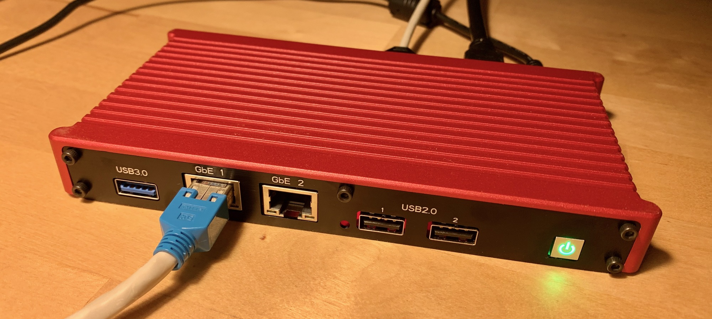

# Congatec x86 BSP/CGOS for NixOS

*[Congatec](https://www.congatec.com)* embedded modules contain a board controller
(cBC) that offers access to a multistage watchdog, non-volatile user data storage,
manufacturing and board information, board statistics and sensors, I²C bus and GPIO.

This repo contains an example NixOS configuration flake that includes five packages.
Ported from the official BSP:

* cgos-mod: Kernel driver for the board controller
* cgos: C library and basic utilities (`cgosdump`, `cgosmon`)
* cgos-util: Congatec System Utility (`cgutlcmd` – could not make any use of it)

Based on `cgos-mod` and `cgos`, my own additions:

* cgos-cgctl: Small custom utility for my use case (board information, watchdog)
* cgos-cgexporter: Prometheus exporter for hardware monitoring

My developement hardware is a *Pascom* labeled
[*EFCO U7-130*](https://www.efcotec.com/Product/smartsl-33340?category=8) embedded
computer featuring a *Congatec Qseven conga-QA3* compute
module (AFAIK).



## Deploy to bare metal

* Boot NixOS installer from USB and follow manual
* Clone this repo and run `nixos-rebuild switch --flake .#conga`
* After reboot try running `cgosdump`, `cgosmon` or `cgctl info`
* Exporter endpoint is http://127.0.0.1:9699

## Example output

### cgosdump

```
CgosDump
CgosLibInitialize successful
CGOS Library Version: 0x01030019
CGOS Driver Version: 0x01000019
Total number of available boards: 1
Number of primary CPU boards: 0
Number of primary VGA boards: 0
Number of boards with CPU functionality: 0
Number of boards with VGA functionality: 0


Board Name #0: "QC31"

Board info
Size of Structure: 184
Flags: 0x0
Primary Class Name: ""
Class Names: ""
Board Name: "QC31"
Board Sub Name: "QA30"
Manufacturer Name: ""
Manufacturer Code: 13
Manufacturing Date: 2020.08.28
Last Repair Date: 2020.08.06
Repair Counter: 0
Serial Number: "000005439999"
Part Number: "615113"
EAN: "04250186112318"
Product Revision: B.0 (0x4230)
System BIOS Revision: 134
BIOS Interface Revision: 000
BIOS Interface Build Revision: 000


Board is named: "QC31"
Boot Counter: 53
Running Time Meter: 154 hours
Number of VGAs: 0
Number of Storage Areas: 3
Number of I2C Buses: 6
Number of Digital IOs: 1
Number of Watchdogs: 1
Number of Temp Sensors: 4
Number of Fans: 1
Number of Voltage Sensors: 3


Number of Storage Areas: 3
Storage Area: 0 Type: 0x00050000 Size:       64 Block Size:        0
Storage Area: 1 Type: 0x00010000 Size:       32 Block Size:        0
Storage Area: 2 Type: 0x00040000 Size:       32 Block Size:        0

Number of I2C Buses: 6
I2C Bus: 0 Type: 0x00010000
I2C Bus: 1 Type: 0x00020000
I2C Bus: 2 Type: 0x00030000
I2C Bus: 3 Type: 0x00040000
I2C Bus: 4 Type: 0x00020000
I2C Bus: 5 Type: 0x00050000

Watchdog Info for: 0
Size of Structure: 40
Flags: 0x0
Min Timeout: 0
Max Timeout: 16777215
Min Delay: 0
Max Delay: 16777215
Supported OpModes: 0xf
Max Stage Count: 3
Supported Events: 0xf
Type: 0x00020000

Watchdog Config for: 0
Size of Structure: 48
Timeout: 0
Delay: 0
Mode: 0x80
OpMode: 0x2
Stage Count: 3

Stage: 0
  Timeout: 0
  Event: 0x2

Stage: 1
  Timeout: 0
  Event: 0x2

Stage: 2
  Timeout: 0
  Event: 0x2


Done
```

### cgosmon

```
Temperature sensors
===================
Type of sensor:      CPU temperature
Unit number:         0
Resolution:          0
Minimum temperature: 0 degrees centigrade
Maximum temperature: 0 degrees centigrade
Current temperature: 0 degrees centigrade

Type of sensor:      Board temperature
Unit number:         1
Resolution:          0
Minimum temperature: 0 degrees centigrade
Maximum temperature: 0 degrees centigrade
Current temperature: 41 degrees centigrade

Type of sensor:      
Unit number:         2
Resolution:          0
Minimum temperature: 0 degrees centigrade
Maximum temperature: 0 degrees centigrade
Current temperature: 0 degrees centigrade

Type of sensor:      
Unit number:         3
Resolution:          0
Minimum temperature: 0 degrees centigrade
Maximum temperature: 0 degrees centigrade
Current temperature: 0 degrees centigrade


Voltage sensors
===============
Type of sensor:      5V supply voltage (5V_S0)
Unit number:         0
Resolution:          0
Nominal voltage:     0.0 V
Minimum voltage:     0.0 V
Maximum voltage:     0.0 V
Current voltage:     5.105 V

Type of sensor:      5V standby voltage (5V_S5)
Unit number:         1
Resolution:          0
Nominal voltage:     0.0 V
Minimum voltage:     0.0 V
Maximum voltage:     0.0 V
Current voltage:     5.90 V

Type of sensor:      
Unit number:         2
Resolution:          0
Nominal voltage:     0.0 V
Minimum voltage:     0.0 V
Maximum voltage:     0.0 V
Current voltage:     0.549 V


Fan sensors
===========
Type of sensor:      CPU fan
Unit number:         0
Nominal speed:       0 rpm
Minimum speed:       0 rpm
Maximum speed:       0 rpm
Current speed:       0 rpm
```

### cgctl info

```
{
  "Board": {
    "BoardName": "QC31",
    "SerialNumber": "000005439999",
    "ManufacturingDate": "2020/08/28",
    "BootCounter": 53,
    "OperatingHours": 154
  },
  "Temperatures": {
    "Board": 41.5
  },
  "Voltages": {
    "5V_S0": 5.11,
    "5V_S5": 5.09
  }
}
```

### cgctl help

```
Usage: cgctl <command> [option]

Commands:

    help        Show this help text

    info        Get and display various board information

                    -j    Output in JSON format (default)

    wdog        Watchdog access

                    -d    Disable watchdog
                    -t    Trigger watchdog
                    -j    Output in JSON format (default)
```

### curl -v http://localhost:9699

```
*   Trying [::1]:9699...
* connect to ::1 port 9699 failed: Connection refused
*   Trying 127.0.0.1:9699...
* Connected to localhost (127.0.0.1) port 9699
> GET / HTTP/1.1
> Host: localhost:9699
> User-Agent: curl/8.4.0
> Accept: */*
> 
< HTTP/1.1 200 OK
< Connection: close
< Content-Length: 662
< Content-Type: text/plain; version=0.0.4
< Date: Wed, 17 Jan 2024 17:25:57 GMT
< 
# HELP congatec_boot_counter Number of system boots
# TYPE congatec_boot_counter counter
congatec_boot_counter 61

# HELP congatec_operating_hours Number of operating hours
# TYPE congatec_operating_hours counter
congatec_operating_hours 270

# HELP congatec_temp_celsius Hardware monitor for temperature
# TYPE congatec_temp_celsius gauge
congatec_temp_celsius{name="Board"} 45.500

# HELP congatec_voltage_volts Hardware monitor for voltage
# TYPE congatec_voltage_volts gauge
congatec_voltage_volts{name="5V_S0"} 5.070

# HELP congatec_voltage_volts Hardware monitor for voltage
# TYPE congatec_voltage_volts gauge
congatec_voltage_volts{name="5V_S5"} 5.090

* Closing connection
```

## Notes

* The original `cgosmon` does not display decimal numbers (like voltage) correctly
  in all cases (compare with `cgctl` output above).

* `cgctl` and `cgexporter` are bespoke tools for my use case (and this specific
  compute module). They may act funny with other system configurations, but they
  should also be easy to patch to meet your needs.

* The watchdog's *ACPI Restart* event was received by the kernel but resulted in
  `ACPI: OSL: Fatal opcode executed`, `acpi_listen` does not catch the event. Plain
  reset works fine.

## Further reading

* [Original Congatec BSP for Yocto](https://git.congatec.com/x86/meta-congatec-x86)
